# Architecture

This project is built around a robust data pipeline and a modern web frontend. Understanding the architecture is key for contributors who want to extend its capabilities.

## Data Pipeline

The core of the project is a TypeScript-based pipeline that handles data ingestion, processing, analysis, and exporting. It's designed to be modular and extensible.

The pipeline consists of several stages:

1.  **Ingest**: Fetches the latest data from the GitHub API, including pull requests, issues, comments, and commits.
2.  **Process**: Analyzes the raw data to calculate contributor scores, identify focus areas, and determine skill levels based on file patterns.
3.  **Export**: Generates structured JSON files containing the processed metrics for different time intervals (daily, weekly, monthly).
4.  **Summarize**: Uses the exported data to generate AI-powered summaries of project and contributor activity.

You can run these stages individually using the `bun run pipeline <command>` interface.

## Data Management Strategy

A unique aspect of this project is how it manages data to keep the main Git history clean and focused on code.

### 1. Separate Data Branch

All data generated by the pipeline (JSON exports, markdown summaries, and the database itself) is stored in a dedicated branch, typically named `_data`. This prevents the main branch from being cluttered with thousands of data commits.

### 2. Database Serialization

We use the [`sqlite-diffable`](https://github.com/simonw/sqlite-diffable) utility to store the contents of the SQLite database as version-controlled text files. This allows Git to efficiently track changes to the database over time, providing a complete audit trail.

### 3. CI/CD Integration

Our GitHub Actions workflows are designed to work with this data strategy.

- The `run-pipelines` workflow checks out the `_data` branch to access the latest data, runs the pipeline, and commits the new data back to the `_data` branch.
- The `deploy` workflow pulls the latest data from the `_data` branch before building the static website, ensuring the site is always up-to-date.

This architecture ensures a clean separation between code and data, making the project easier to maintain and scale.

## Frontend

The website is a [Next.js](https://nextjs.org/) application that uses the App Router. It's built with:

- **React** and **TypeScript**
- **Tailwind CSS** for styling
- **shadcn/ui** for the component library
- **Drizzle ORM** for interacting with the database on server components.

The site is statically generated at build time, with pages for individual contributors, leaderboards, and interval-based reports. This ensures the best possible performance and SEO.

## Detailed Data Flow

Based on the provided sources, the system's data flow can be described as a **multi-stage analytics pipeline** that processes GitHub activity to generate scores, tags, summaries, and statistics. The data originates from **GitHub** and flows through distinct phases: **Ingest**, **Process**, **Export**, and **Summarize**.

Here is a high-level overview of the data flow:

1.  **Data Ingestion (`ingest`)**

    - **Source:** The pipeline starts by **fetching raw data directly from the GitHub API** using the `GitHubClient`. This client handles pagination and rate limiting for efficient data retrieval.
    - **Data Fetched:** This includes **Pull Requests**, **Issues**, **Commits**, and associated data like files changed, comments, reactions, and reviews. The ingestion can be configured for specific date ranges or repositories.
    - **Storage:** The fetched raw data is **stored in a SQLite database** using Drizzle ORM. Tables like `rawPullRequests`, `rawIssues`, `rawCommits`, `prReviews`, `prComments`, `issueComments`, `prReactions`, `issueReactions`, etc., are populated. Basic user information is also managed here.
    - **Mechanism:** The ingestion process checks the `lastFetchedAt` timestamp for repositories to avoid re-fetching data that hasn't changed, unless a `--force` flag is used.

2.  **Data Processing (`process`)**

    - **Source:** This stage primarily reads the **raw activity data from the SQLite database**.
    - **Processing:** It calculates **contributor scores** based on various activities (PRs, issues, reviews, comments, code changes) according to defined scoring rules. It also calculates **tags and expertise levels** for contributors based on patterns found in their contributions (like file paths and PR titles) and their accumulated scores (XP).
    - **Storage:** The results, such as **daily user scores** and **user tag scores/levels**, are **stored back into the SQLite database** in tables like `userDailyScores` and `userTagScores`. This stage can also be forced to recalculate scores even if they exist.

3.  **Data Export (`export`)**

    - **Source:** This stage reads aggregated and processed data **from the SQLite database**.
    - **Processing:** It compiles **repository statistics** for specific time intervals (daily, weekly, monthly). These stats include project metrics (total PRs, issues, contributors, code changes), top issues, and top pull requests.
    - **Storage:** The generated statistics are **exported as JSON files** to a designated output directory, structured by repository ID, data type ("stats"), and interval type. The export skips generating files that already exist unless forced.

4.  **AI Summary Generation (`summarize`)**
    - **Source:** This stage reads **relevant metrics and data from the SQLite database** (like project metrics or contributor metrics).
    - **Processing:** It formats this data into prompts and sends them to an **external AI service** (configured via API key and endpoint) to generate **natural language summaries** of project or contributor activity.
    - **Storage:** The generated summaries are **stored in the SQLite database** in tables `repoSummaries` (for project summaries) and `userSummaries` (for contributor summaries). Project summaries are also **exported as Markdown files**. Like export, summary generation skips existing summaries unless forced.

**Central Storage:** The **SQLite database** (`data/db.sqlite`) serves as the central hub for raw GitHub data, processed scores, tags, and generated summaries. A database migration system (`drizzle`) manages schema changes. The database content can be serialized into diffable text files for version control and data synchronization across environments.

**Website Presentation:** The calculated scores, tags, and generated summaries are consumed by the Next.js website to display the **Leaderboard**, **Contributor Profile Pages**, and **Interval Summary Pages**. These components query the database or read the exported static files to display the information.

**Orchestration:** **GitHub Actions workflows** automate the execution of these pipelines on a schedule or manual trigger, managing the data flow, database state (including restoring from/dumping to a data branch), and deployment to GitHub Pages.

## System Architecture Diagram

```mermaid
flowchart TD
    %% External Services
    GitHubAPI["GitHub API"]:::external
    AIService["AI Service<br/>(OpenRouter/OpenAI)"]:::external
    UVSync["uv Service"]:::external

    %% CI/CD Layer
    subgraph "CI/CD Orchestration"
        direction TB
        GHActions["GitHub Actions Runner"]:::infra
        CLIOrch["CLI Orchestrator"]:::service
    end

    %% Data Pipeline
    subgraph "Data Pipeline"
        direction TB
        CLIOrch -->|runs| IngestModule
        IngestModule["Ingest Module"]:::pipeline
        ProcessModule["Process/Score Module"]:::pipeline
        SummarizeModule["Summarize Module"]:::pipeline
        ExportModule["Export Module"]:::pipeline

        GitHubAPI -->|fetch events| IngestModule
        IngestModule -->|writes to| SQLiteDB
        SQLiteDB -->|read/write| ProcessModule
        ProcessModule -->|writes scores| SQLiteDB
        SummarizeModule -->|reads from DB| SQLiteDB
        SummarizeModule -->|calls AI| AIService
        SummarizeModule -->|writes summaries| DataRepo
        ExportModule -->|reads from DB| SQLiteDB
        ExportModule -->|writes JSON| DataRepo
        CLIOrch -->|sync production DB| UVSync
        CLIOrch -->|push data| GHActions
    end

    %% Database
    SQLiteDB["SQLite DB<br/>(Drizzle ORM)"]:::db

    %% Data Repository
    DataRepo["_data Branch<br/>(JSON & DB dumps)"]:::storage

    %% Auth Worker
    AuthWorker["Auth Worker Service"]:::service
    AuthWorker -->|OAuth callback| NextFrontend
    NextFrontend -->|initiate OAuth| AuthWorker

    %% Frontend Layer
    subgraph "Frontend"
        direction TB
        NextFrontend["Next.js App"]:::frontend
        Components["UI Components"]:::frontend
        NextFrontend -->|uses| Components
    end

    %% Hosting
    Hosting["GitHub Pages"]:::infra
    GHActions -->|on push main<br/>build & deploy| NextFrontend
    NextFrontend -->|deploy| Hosting

    %% Click Events
    click GitHubAPI "src/lib/data/github.ts"
    click CLIOrch "cli/analyze-pipeline.ts"
    click CLIOrch "cli/data-sync.ts"
    click CLIOrch "src/lib/pipelines/runPipeline.ts"
    click IngestModule "src/lib/pipelines/ingest/index.ts"
    click IngestModule "src/lib/pipelines/ingest/pipeline.ts"
    click IngestModule "src/lib/pipelines/ingest/context.ts"
    click IngestModule "src/lib/pipelines/ingest/storePullRequests.ts"
    click IngestModule "src/lib/pipelines/ingest/storeIssues.ts"
    click ProcessModule "src/lib/pipelines/contributors/index.ts"
    click ProcessModule "src/lib/pipelines/contributors/contributorScores.ts"
    click ProcessModule "src/lib/scoring/scoreCalculator.ts"
    click ProcessModule "src/lib/scoring/queries.ts"
    click ExportModule "src/lib/pipelines/export/index.ts"
    click ExportModule "src/lib/pipelines/export/exportRepoStats.ts"
    click DataRepo "data/"
    click SummarizeModule "src/lib/pipelines/summarize/index.ts"
    click SummarizeModule "src/lib/pipelines/summarize/callAIService.ts"
    click SummarizeModule "src/lib/pipelines/summarize/aiContributorSummary.ts"
    click SummarizeModule "src/lib/pipelines/summarize/aiProjectSummary.ts"
    click SummarizeModule "src/lib/pipelines/summarize/config.ts"
    click SQLiteDB "drizzle.config.ts"
    click SQLiteDB "drizzle/"
    click SQLiteDB "src/lib/data/db.ts"
    click SQLiteDB "src/lib/data/db-nextjs.ts"
    click SQLiteDB "src/lib/data/schema.ts"
    click AuthWorker "auth-worker/src/index.ts"
    click AuthWorker "auth-worker/package.json"
    click AuthWorker "auth-worker/wrangler.toml"
    click NextFrontend "src/app/"
    click Components "src/components/"
    click NextFrontend "next.config.js"
    click GHActions ".github/workflows/run-pipelines.yml"
    click GHActions ".github/workflows/deploy.yml"
    click GHActions ".github/actions/pipeline-data/action.yml"
    click GHActions ".github/actions/restore-db/action.yml"

    %% Styles
    classDef external fill:#E0F7FA,stroke:#006064,stroke-width:2px,shape:cloud
    classDef infra fill:#FFF3E0,stroke:#E65100,stroke-width:2px
    classDef service fill:#E3F2FD,stroke:#1565C0,stroke-width:2px
    classDef pipeline fill:#E8EAF6,stroke:#303F9F,stroke-width:2px
    classDef db fill:#E8F5E9,stroke:#2E7D32,stroke-width:2px,shape:cylinder
    classDef storage fill:#F3E5F5,stroke:#6A1B9A
```

