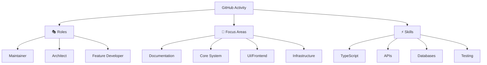
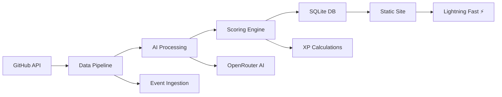

# ElizaOS HiScores 🏆

## Vision: Open Source as The Great Online Game

:::tip 🎮 Level Up Your Contributions
We're building the reputation layer for open source development. Inspired by RuneScape's skill system, every commit earns XP, every review levels up your skills, and your contributions become your permanent digital identity.
:::

## The Problem 🚨

:::warning The Open Source Value Gap
Open source creates extraordinary value - [Harvard research shows $1 invested in OSS generates $2,000 of value](https://www.hbs.edu/ris/Publication%20Files/24-038_51f8444f-502c-4139-8bf2-56eb4b65c58a.pdf#page=31.22) for companies, totaling **$8.8 trillion**. Contributors generate thousands of dollars in value for every dollar invested, yet receive almost nothing in return.
:::

### Current Challenges

| Problem                                    | Impact                                                                                                          |
| ------------------------------------------ | --------------------------------------------------------------------------------------------------------------- |
| 💸 **Massive value, minimal compensation** | OSS supports core infrastructure across industries, yet most maintainers receive little to no financial support |
| 🗂️ **Critical context scattered**          | Information spread across GitHub, Discord, Twitter - impossible to track holistic contributions                 |
| 👻 **Expertise is invisible**              | Difficult to see who actually knows what in massive projects                                                    |
| 🏝️ **No portable reputation**              | Recognition siloed per project, no way to track long-term cross-project impact                                  |

:::success Our Mission
We're changing that by creating **digital status symbols that can't be bought, only earned**. Your profile becomes your developer resume, your reputation proof, and your achievement showcase - all generated from actual contributions.
:::

## Our Solution 🛠️

:::info MMORPG-Inspired Analytics
A powerful analytics pipeline that transforms GitHub activity into living developer profiles. Inspired by MMORPG progression systems, we track expertise across three dimensions:
:::

### 📊 Three Dimensions of Expertise

| Dimension          | What It Tracks                              | Example                                  |
| ------------------ | ------------------------------------------- | ---------------------------------------- |
| 🎭 **Roles**       | What type of contributor you are            | Maintainer, Architect, Feature Developer |
| 🎯 **Focus Areas** | Which parts of the codebase you work on     | Docs, Core, UI, Infrastructure           |
| ⚡ **Skills**      | Technologies you demonstrate proficiency in | TypeScript, APIs, Databases              |

:::tip XP System in Action
Every merged PR containing documentation changes increases your **docs XP**. Work on core architecture? Your **architect role** levels up. The more you contribute to specific areas, the higher your expertise becomes - making it clear who knows what in any project.
:::

## The Tech Stack ⚙️

:::note Built for Scale & Performance
The entire system is open source, from ingestion to visualization.
:::

### 🏗️ Architecture Overview

| Component              | Technology                 | Purpose                                                         |
| ---------------------- | -------------------------- | --------------------------------------------------------------- |
| 🔄 **Data Pipeline**   | TypeScript + Drizzle ORM   | Automated GitHub ingestion processing thousands of events daily |
| 🤖 **AI Intelligence** | OpenRouter (GPT-4o/Claude) | AI-powered summaries surfacing signal from noise                |
| 🎮 **Scoring Engine**  | Custom Algorithms          | RuneScape-inspired XP calculations tracking expertise           |
| 💾 **Storage**         | SQLite + Git               | Version-controlled diffable database dumps                      |
| 🚀 **Deployment**      | GitHub Actions → Vercel    | Static site with lightning-fast performance                     |

### 🔧 Key Features

- ✅ **Real-time Updates**: Live sync with GitHub activity
- ✅ **AI-Powered Insights**: Intelligent contribution summaries
- ✅ **Portable Reputation**: Cross-project expertise tracking
- ✅ **Open Source**: Fully transparent and auditable
- ✅ **Performance**: Sub-second page loads

## Ready to see your true level? 🚀

:::success Join the Game
The leaderboard is live, and every contribution counts. Your next PR could be the one that levels you up!
:::

### 🎯 Quick Links

| Action                    | Link                                                         | Description                                      |
| ------------------------- | ------------------------------------------------------------ | ------------------------------------------------ |
| 🏆 **View Leaderboard**   | [elizaos.github.io](https://elizaos.github.io)               | See the current rankings and find your profile   |
| 💻 **Start Contributing** | [github.com/elizaos/eliza](https://github.com/elizaos/eliza) | Join the ElizaOS project and start earning XP    |
| 📖 **Read the Docs**      | [Documentation](./getting-started/overview)                  | Learn how the scoring system works               |
| 🔧 **API Reference**      | [API Docs](./api/modules)                                    | Explore the data pipeline and scoring algorithms |

### 🎮 Getting Started

1. **🔍 Find Your Profile**: Search for your GitHub username on the leaderboard
2. **📊 Analyze Your Stats**: See your expertise breakdown across roles, areas, and skills
3. **🎯 Level Up**: Make contributions to increase your XP and climb the rankings
4. **🏅 Earn Achievements**: Unlock new badges and recognition as you contribute

:::tip Pro Tip
Focus on areas where you want to build expertise. Consistent contributions to specific domains will establish you as a go-to expert in those technologies!
:::

---

_The game has already begun. Time to claim your place on the leaderboard._ 🏆
